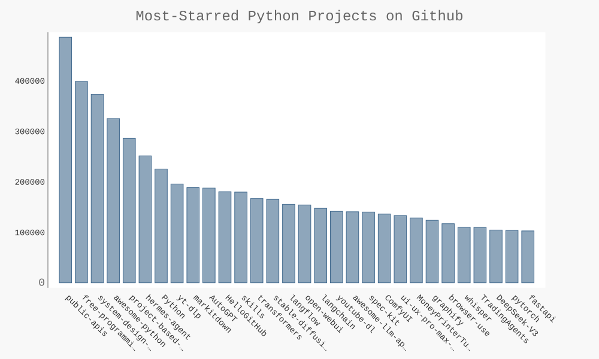
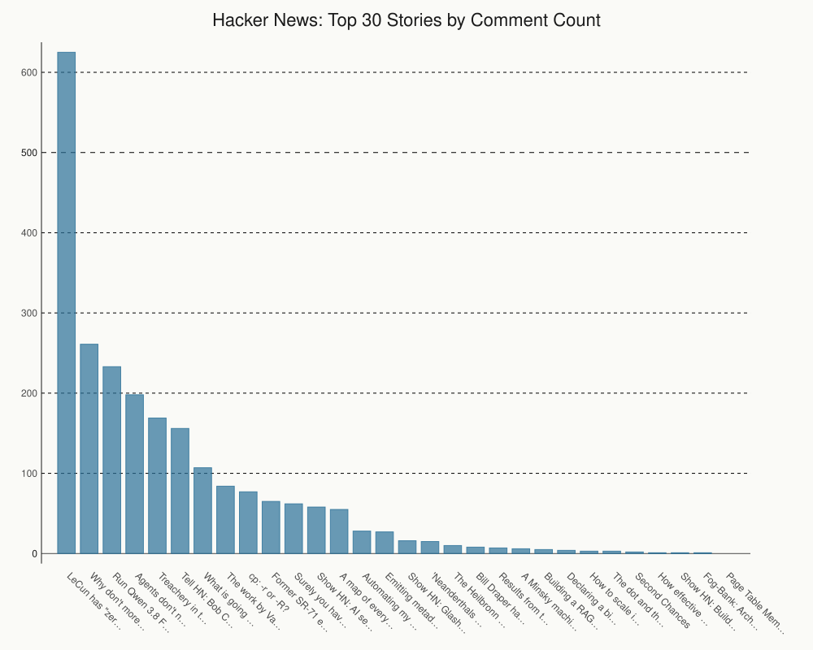
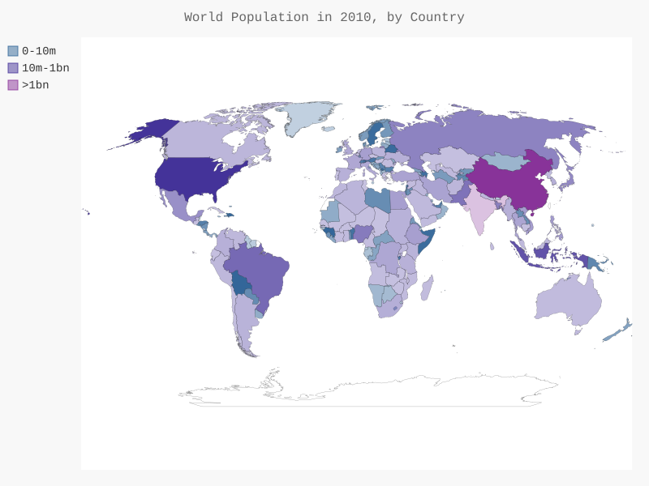
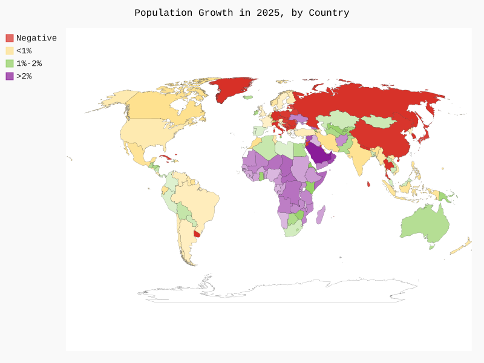

# Data Visualization

Practice projects following the Data Visualization part of the *Python Crash Course* book, along with related practice and exploration beyond the book's exercises. This part is complete.

## Contents

### Generating Data
Generating datasets and plotting them with matplotlib and pygal.
- **Squares and scatter plots:** `mpl_squares.py`, `scatter_squares.py`
- **Random walks:** `random_walk/` includes matplotlib and pygal versions plus a molecular-motion variant.
- **Dice rolls:** `roll_dies/` includes histograms for one, two and three dice, dice of different sizes, and multiplied results.

### Downloading Data
Working with CSV and JSON data.
- **Weather (CSV):** high/low temperature plots for Sitka, Death Valley and several Metro Vancouver cities (`highs_lows.py`, `highs_lows_metrovan.py`).
- **World population (JSON):** world maps built with pygal (`world_population.py`, `americas.py`, `na_populations.py`).
- **Population growth:** `population_growth_proj/` maps growth for 2023 to 2025.
- **Tests:** `test_get_country_code.py` tests the country code lookup.

### Working with APIs
Pulling live data from web APIs and visualizing it with pygal.
- **GitHub:** `python_repos.py` charts the most-starred Python repositories. It also produced charts for C, Go and JavaScript. `test_python_repos.py` tests the API call with mocked responses.
- **Hacker News:** `hn_submissions.py` charts the top submissions and their comment counts.
- **Custom bar chart:** `bar_descriptions.py` shows custom tooltip labels.

## Example Charts

**Most-starred Python projects on GitHub** (`working_with_apis/python_repos.py`)



**Top Hacker News submissions by comments** (`working_with_apis/hn_submissions.py`)



**Rolling three dice** (`Generating Data/roll_dies/`)


**Random walk** (`Generating Data/random_walk/`)


**World population map** (`downloading_data/world_population.py`)



**Population growth, 2025** (`downloading_data/population_growth_proj/`)



## Running

Use the project virtual environment, which has the dependencies installed (requests, pygal, matplotlib).

```
source venv/bin/activate
cd working_with_apis
python python_repos.py
python -m unittest test_python_repos -v
```
